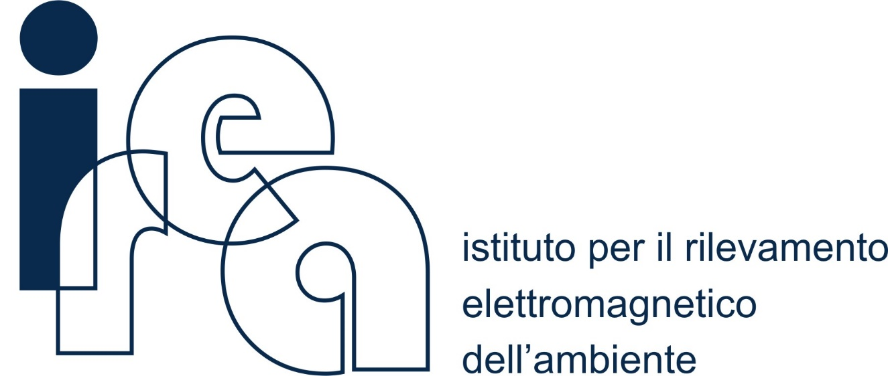

<!-- README.md is generated from README.Rmd. Please edit that file -->

```{r, include = FALSE}
knitr::opts_chunk$set(
  collapse = TRUE,
  comment = "#>",
  fig.path = "figures/README-",
  out.width = "100%",
  echo = FALSE
)
```


# ECOSS Tools 

<!-- badges: start -->
<!-- other badges https://github.com/GuangchuangYu/badger -->
`r badger::badge_code_size("oggioniale/ECOSS-parametersDirectives")`
`r badger::badge_last_commit("oggioniale/ECOSS-parametersDirectives")`
<!-- `r badger::badge_doi("10.1111/2041-210X.12628", "blue")` -->
<!-- badges: end -->

*ECOSS Tools* are part of the implementation work done in the framework of the [Interreg Italy-Croatia project ECOSS](https://www.italy-croatia.eu/) WP5 - Design and implementation of data infrastructure.

*ECOSS Tools* general aims is to provide an interactive application to respond to the need of the sites involved in the [ECOlogical observing system in the Adriatic Sea (ECOAdS)](https://ecoads.eu) in term of conservation strategies and contribution to the main EU directives.
The ECOSS Tools are designed to exploit the information collected in the ECOSS project integrating them with those already existing on the web, resulting in a graphical representation of the monitoring activities at the sites.

ECOAdS includes two types of sites: Long Term Ecological Research (LTER) and Natura 2000 (N2K) sites, belonging to the [LTER network](https://www.lter-europe.net/lter-europe) and the Natura 2000 network](https://ec.europa.eu/environment/nature/natura2000/awards/natura-2000-network/index_en.htm), respectively.

*ECOSS Tools* allow to:

1. Evaluate the sites, both LTER and N2K, contribution to the Marine Strategy Framework Directive (MSFD) monitoring activities (**Directive contribution**);

2. Evaluate the N2K sites contribution to the conservation of the specific target species and habitats included in the site (**Conservation strategy**).

*ECOSS Tools* can be reached starting from the ECOAdS portal, directly from the map on the HomePage, by accessing each sites page (e.g. [Cres - Lošinj page](https://ecoads.eu/site/2e6014fe-8f3b-4127-8ab1-405ae1303281/)) trough the "Tools" section.

By clicking on **site contribution** the tool dedicated to assessing the contribution of the site, in terms of measured parameters, to the MSFD criteria elements will open.
Otherwise selecting the **conservation strategy**, the tool will show the contribution of the N2K site to the conservation of target species and habitats.

The site contribution is evaluated basing on the number of observed parameters, corresponding to the parameters suitable for assessing a MSFD criteria. The conservation strategy contribution is evaluated by comparing the number of ecological, oceanographic, and pressure variables measured at the site with the variables indicated by ECOSS as fundamental for assessing the state of conservation of the specific target species/habitat.

During the ECOOS project, a great effort was devoted both to identify the parameters to be monitored in order to accomplish the MSFD criteria needs and to recognize the variable that better contribute to the conservation strategies. The results of this work are delivered in the following documents and publications:

...

<!-- about the icons https://github.com/ikatyang/emoji-cheat-sheet -->
## :notebook_with_decorative_cover: Citation

To cite *ECOSS Tools* please use:

...


## :movie_camera: Video tutorial

```{r}
vembedr::embed_youtube(
  '',
  width = NULL,
  height = 300,
  ratio = c("16by9", "4by3"),
  frameborder = 0,
  allowfullscreen = TRUE,
  query = NULL
)
```


## :chart_with_downwards_trend: Data below *ECOSS Tools*

(Description of Thesaurus, some part included and ontology)


## :writing_hand: Authors

Alessandro Oggioni <http://www.cnr.it/people/alessandro.oggioni>

Paolo Tagliolato <...>


## :office: Contributing organizations
<a href="http://www.irea.cnr.it/en/"></a>
